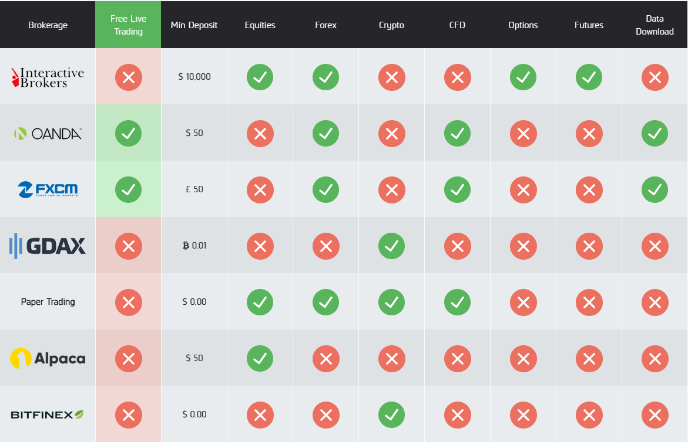
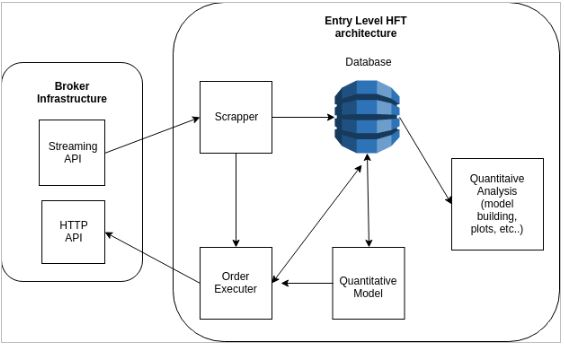

# Tuesday, August 13, 2019

[Return to main page](index.md)

## Issues
- Trading
    - Asset Class (what do we trade?)
    - Frequency (when do we trade?)
    - Strategy (how do we trade?)
    - Trading Architecture (design of our trading system)
        1. Brokerage 
        2. Database
- Firm
    - Mission (why do we trade?)
    - Capital Structure (money in)
    - Pay Structure (money out)
    - Responsibilities (who does what?)

## I. Trading
### A. Asset Class
We must decide what we trade:
- equities
- forex
- crypto
- contracts for difference (CFD)
- options
- futures

Courtesy of [QuantConnect](https://www.quantconnect.com), here is a table of what asset classes different brokerages support:

For the sake of conceptual ease and familiarity, I suggest that we begin trading with any one asset class of **equities**, **forex**, or **crypto**.

Before I make my argument for forex, I want to provide a brief summary of this particular market. The **foreign exchange market**, also commonly referred to as the **forex** or **FX** market, is a market for trading currencies. FX has several key characteristics:
- **accessible**, refer to the graphic above
- **speculative**, i.e. traders seek profit from short-term fluctuations in the market rather than from the fundamental value of the asset
- **over-the-counter (OTC)**, decentralized with no physical exchange such as the NYSE; this means less transparency, which further means more risk
- **very liquid**
    - ~$5 trillion in daily trading volume, although retail trading accounts for only about 5-6% of overall volume, so we would operate in ~$300 billion market
- no limits on position size 
- open 24hrs/d, 5d/wk
- absence of “insider trading”; e.g., if I learned from a client that the Bank of Japan is planning to raise interest rates, I could purchase as much Japanese yen as I like without the fear of an insider trading penalty

### B. Frequency
We must decide how often we trade. 

To begin actively trading financial assets is to assert the following: the market is inefficient. If you believe that the market is inefficient, you believe that the market’s assets are not always traded at their fair values and that you can profit from these inefficiencies. 

We compete with others who also search for market inefficiencies in an attempt to correct them. Since we have competitors in our market, the probability that we discover an inefficiency before it is corrected diminishes the longer we take to search for inefficiencies. As we narrow our investing timeline, market inefficiencies become more predictable, and thus our competition becomes stronger. 

The use of Python and REST API calls make trading expressive, accessible, and convenient. But due to its limited speed, this approach to systematic trading sets a lower bound on our investing timeline, i.e. we are precluded from ultra-low-latency trading. 

I have considered the following: to implement and backtest a strategy in Python on a paper trading account and then to port the strategy to C/C++/Java on a live trading account. I am unsure if the performance edge we would gain from C++/Java is worth the hassle of porting our strategies, so this approach is certainly open to discussion. 

The frequency at which we trade will most likely be determined by the strategy we choose to implement.

### C. Strategy
This is probably what most of us think about first when considering trading. What strategy will we implement for systematically trading financial assets? I will keep this section short because, ironically, it is mostly irrelevant to us at this stage of the firm.

### D. Trading Architecture
How will we implement our trading strategy? This and the previous task will occupy the majority of our time after we complete initial set-up activities. Per [this](https://towardsdatascience.com/assembling-an-entry-level-high-frequency-trading-hft-system-e7538545b2a9) TDS article, I suggest that we build according to a **microservices architecture**:

This is an oversimplified diagram, but it contains all the components we would need. Imagining the above diagram as a collection of “services”: 

- streaming API: service that streams market data via GET requests
- scraper: (I think the TDS author meant ‘scraper’) service that stores market data streamed from the brokerage via the brokerage’s API into a time series database
- database: high-density, scalable collection of time series data that is capable of rapid re-sampling
    - quantitative analysis: activities including but not limited to the following:
        - exploratory data analysis (EDA)
        - model development
        - model backtesting
        - events logging
    - quantitative model: service that receives data from the database and signals when alpha is present
    - order executor: service that receives signals from the model and interacts with the market via the brokerage’s HTTP API
    - HTTP API: service that places orders via POST requests

Of course, we can always expand and modify this architecture, but applying the diagram above should give us a good start if we were to make each service functional.

#### D.1. Brokerage
Please refer to the QuantConnect infographic above in the *A. Asset Class* section. 

The brokerage we select will determine our workflow, specifically interactions with its API, and capital structure. There is much research and discussion to be done here, but I suggest using **either OANDA or FXCM trading forex**, and maybe we could add another live account with **Alpaca trading equities** on, for example, a long/short strategy in a “quantamental” fashion. I say “quantamental” because we are limited by FINRA regulation of “pattern day traders”--traders who exceed three day trades within five days. Recall that day trading involves the buying and selling of a security within the same trading day.

Escaping this regulation requires an equity balance of at least $25,000 in the trading account before any day trading begins. My best guess is that we would not invest anything near $25,000 in our alternate equities fund. Instead, we can allocate a modest amount of capital to a live trading account utilizing any of the more traditional strategies you might see at a hedge fund today: long/short, event-driven, global macro. Maybe we could feed a percentage of returns from the flagship forex (or crypto) fund into the equities fund, thereby reinvesting in the firm and diversifying our investments. 

#### D.2. Database
What program will we choose to store our market data? The TDS author suggests [InfluxDB](https://www.influxdata.com), and I see no reason not to use this program. But, as with every other decision here, this is open to discussion. 

## II. Firm
### A. Mission
We have to answer *why* we want to trade. 

Initially, I viewed starting a business after Launch as a way to actually get something out of my time with HackCville. For those of us who participated in Launch, we have given a **lot** of resources (time, foregone wages) to HackCville, and we ought to get a lot in return. Why not squeeze out as much value as possible? I know that I was not completely satisfied by $1,750 and another box on my LinkedIn.

In my opinion, Launch was important because it (1) brought together talent and (2) brought together talent with a common interest in quantitative finance. (2) is very powerful, and it would be a shame if we let it go to waste.

We have the potential to learn *significantly* more than we ever did through Countdown and Launch, and we could even earn some money along the way.

At worst, the firm blows up and you have lost time (a lot) and money (hopefully not a lot), but even a failed venture will make for better conversation in an interview than no ventures at all.

At best, we learn tons about trading and quantitative finance, we become better computer scientists, we beat our benchmark, we win more first-round interviews, and we end the semester with more money than we had in the beginning. I would still find all this very worthwhile even if we failed to achieve that last one. 

### B. Capital Structure 
How do we pool together capital? How we raise capital determines how we will organize the remainder of the firm, and we have two choices for fundraising: (1) we trade our own money or (2) we trade our own money and other people’s money. (2) provides remarkably more starting capital, but brings with it remarkably more regulation, so we should stick to (1).

How you as an individual invest in the firm depends on several factors:
- risk tolerance
- financial goals
- current financial situation

### C. Pay Structure
How do we pay out to the firm’s partners? How much money stays in the firm? What happens when we lose money? 

I will not say any more here since we have lots of research and discussion to do here and in the previous section. 

### D. Responsibilities
Who will do what? 

Figuring this out is something I am really looking forward to, and I hope that we fill in this section during our inaugural meeting. 